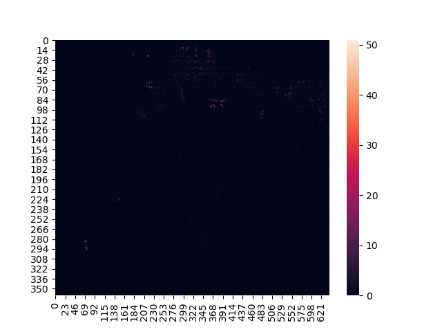

# Generating heatmap on customer behaviour in retail shops
Generating heatmap on customers behavior in retail shops using opencv and yolov3

download yolov3 pretrained [model](https://drive.google.com/file/d/1jNen-em-3JG1uO9iwoBep6xpTAt6se54/view?usp=sharing).

<h1>Heatmap with seaborn</h1>

<h1>Heatmap with opencv</h1>

<h1>Heatmap imposed with video frame</h1>

